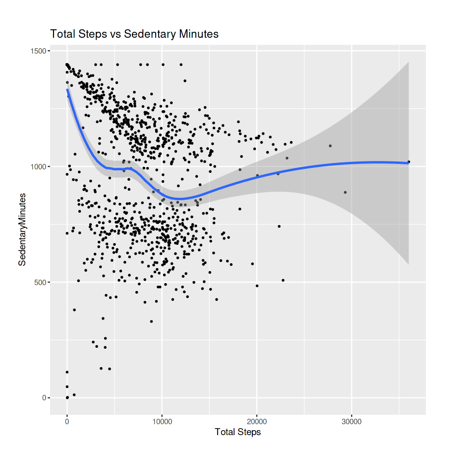
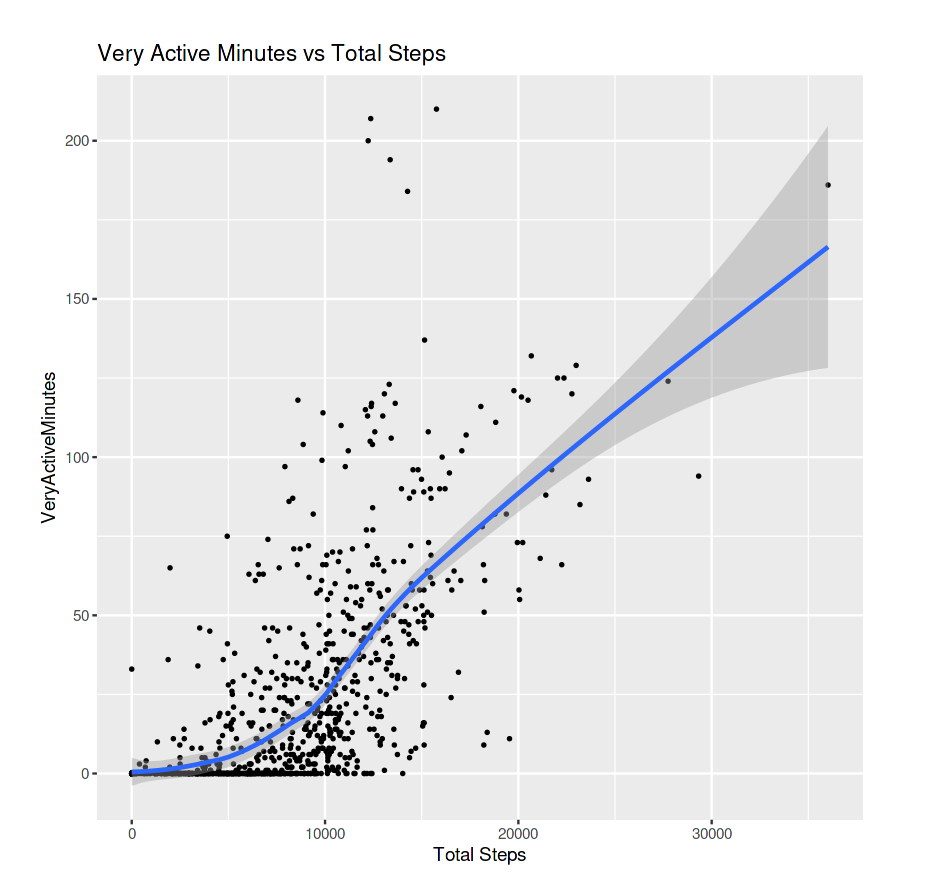
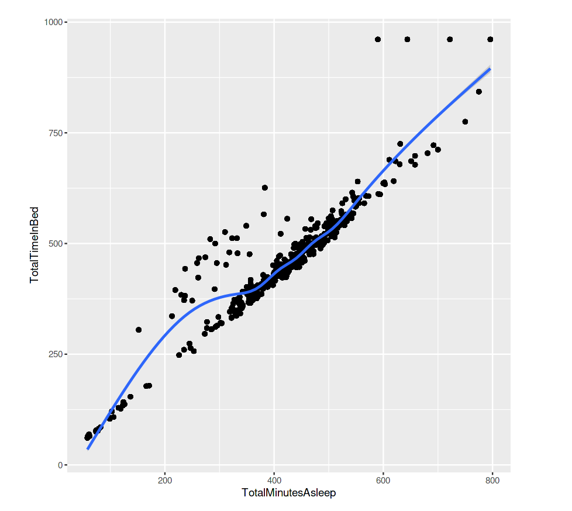
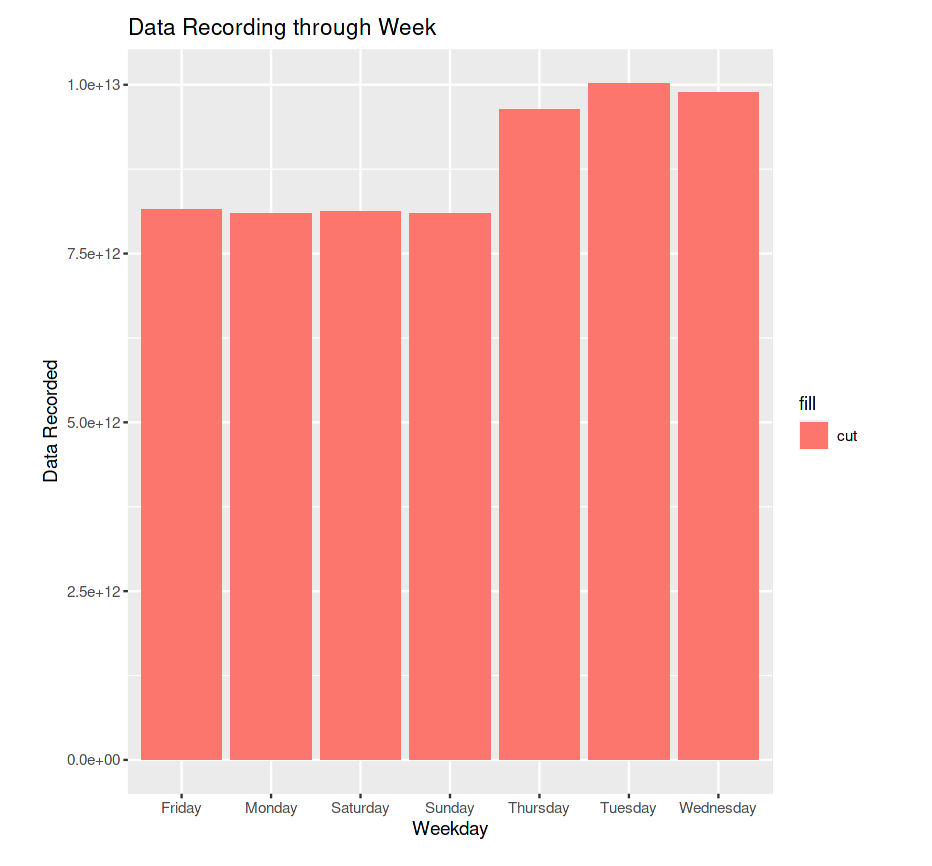
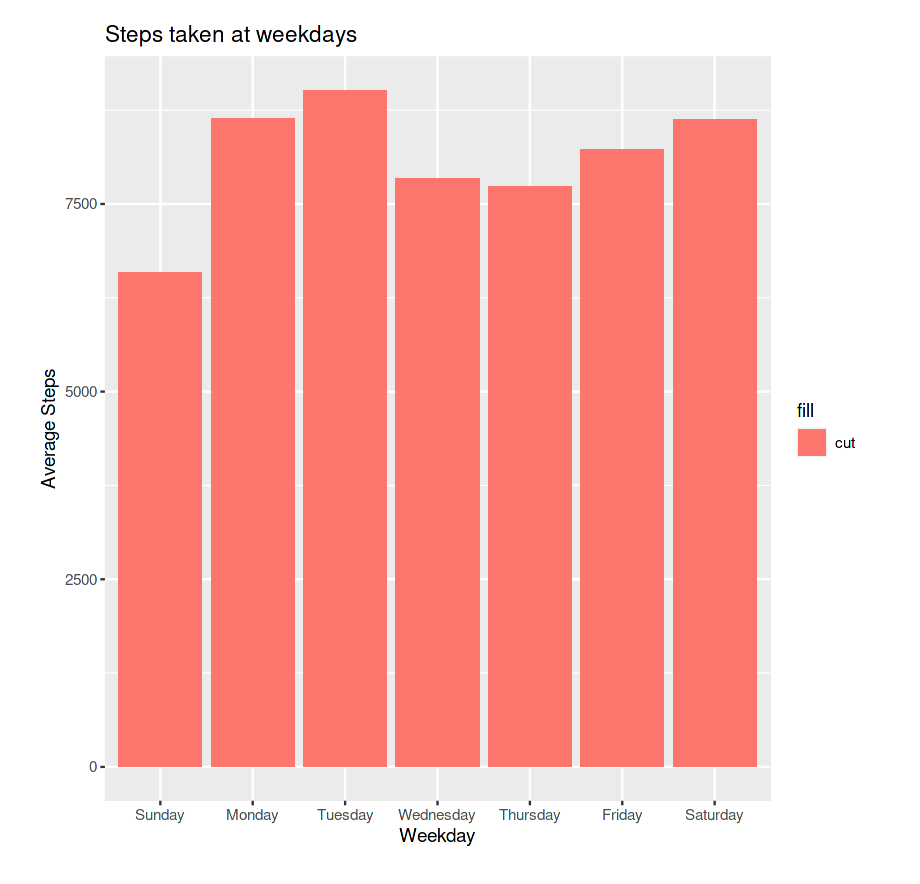
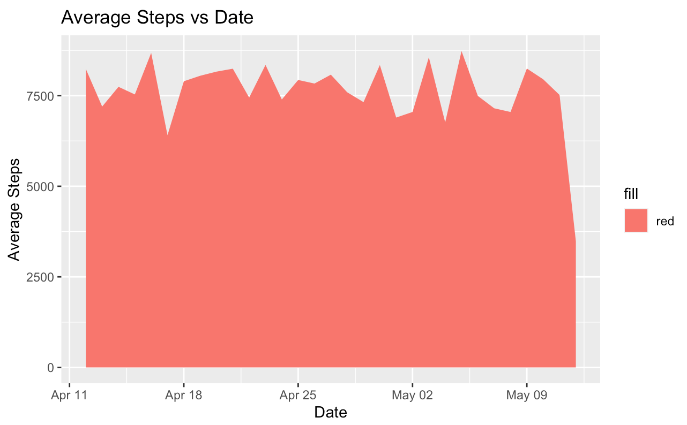
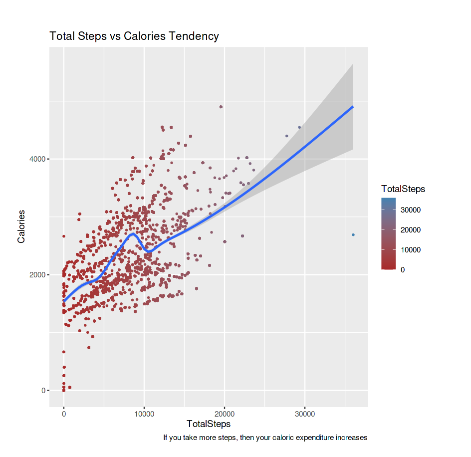
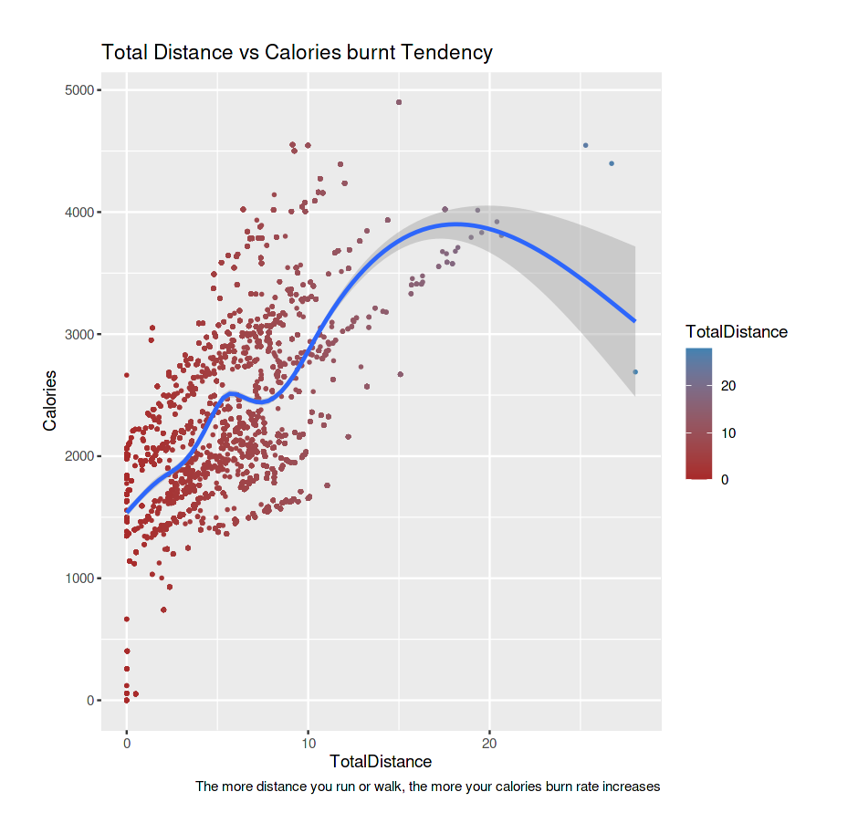
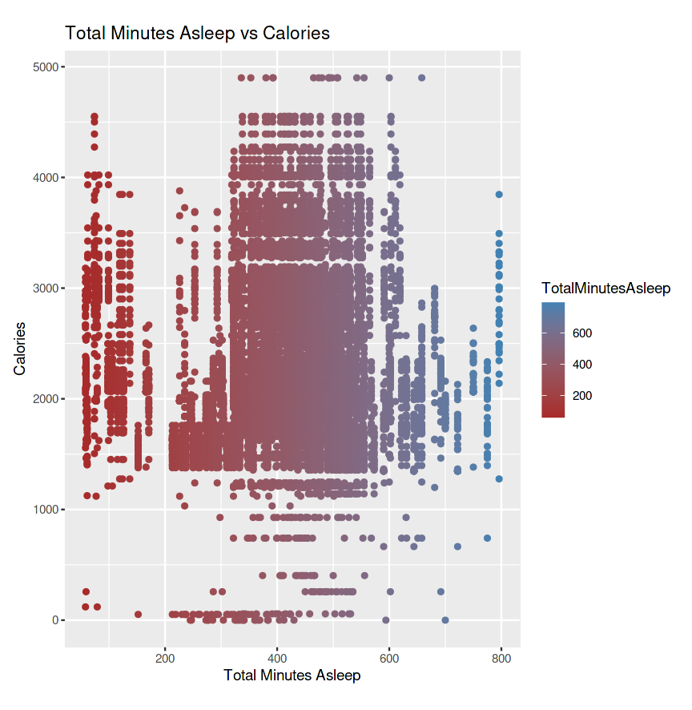
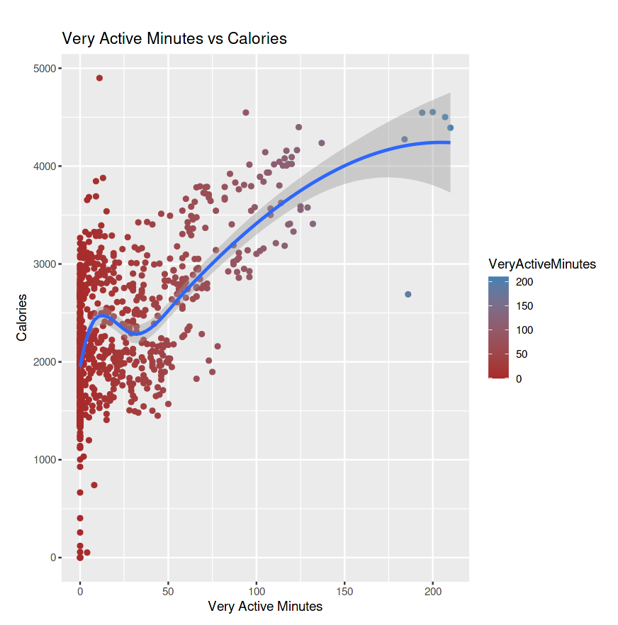

# Bellabeat Case Study 
In the second capstone project of the Google Data Analytics Certificate, also chosed RStudio following a guided roadmap to complete the data analysis process: ask, prepare, process, analyze, share, and act.

## Introduction and Business Statement

Bellabeat, a high-tech manufacturer of health-focused products for women wishes to analyze smart device fitness data, to help guide a marketing strategy for the company and keep growing.

Using the 6 phases of the data analysis process, here are the steps implemented in the present study:

## 1. Ask:

  - Key Tasks: 
  
1. Define and analyze some trends in smart device usage. 
2. Utilize these trends and gain insight with high level recommendations to apply them to customers in order to develop a marketing strategy for the company. 

  - Key stakeholders: marketing analytics team, Sando Mur (Mathematician and Bellabeat’s cofounder; key member of the Bellabeat executive team) and Uršk Srsen (Bellabeat’s cofounder and Chief Creative Officer).

  - Questions to be answered:

  a) What are some trends in smart device usage?
  
  b) How could these trends apply to Bellabeat customers?
  
  c) How could these trends help influence Bellabeat marketing strategy?
  
## 2. Prepare: 

  - Data's credibility: it's a FitBit Fitness Tracker Dataset with 18 CSV from 30 eligible users that includes minute-level output for physical activity, heart rate, and sleep monitoring. It's organized as a well structured database consisting in several tables that shows customers behavior in different metrics. Following the ROCCC approach, the data has:

* Reliable & Original: 30FitBit users who consented to the submission of personal tracker data via Amazon Mechanical Turk.

* Comprehensive: data minute-level output for physical activity, heart rate, and sleep monitoring. While the data tracks many factors in the user activity and sleep, the sample size is small and most data is recorded during certain days of the week (Tuesday through Thursday).

* Current: data date's from March 2016 to May 2016. Might find differencies between the data from users from that period and today's.

* Cited: Unknown.

   - Dataset limitations: 

* Users: there are only 30 users data available. Having a larger sample size would have been ideal for the analysis in order to avoid sample bias.

* 33 users has been found upon further checking with n_distinct() to verify users unique Id, there were 24  from sleep dataset and only 8 from weight. There are 3 extra users in the first one and some users did not record their data.

* In the weight dataset 5 users manually entered their weight and 3 recorded them via a wireless connection device. 

* In later analysis visualizations, it is demonstrated that most of the data was recorded from Tuesday to Thursday, which may not be enough to elaborate an accurate and complete analysis.

* These data frames were chosen to be imported in order to find different patterns and get crucial insight: daily activity, steps, sleep activity, heartrate, weight and minutes. 

## 3.Process: 

Data was imported, organized and cleaned in RStudio because it provides great in-built integrating tools that allowed to do this tasks in a quicker and simpler way inside the same application. 

```{r}
library(tidyverse)
library(readr)
library(ggplot2)
library(dplyr)
library(janitor)
library(skimr)
library(rmarkdown)
library(here)
library(lubridate)
library(knitr)
```

## Importing CSV files

```{r}
dailyActivity <- read_csv("~/Desktop/Fitabase_Data_4.12.16-5.12.16/dailyActivity_merged.csv")
dailyCalories <- read_csv("~/Desktop/Fitabase_Data_4.12.16-5.12.16/dailyCalories_merged.csv")
dailyIntensities <- read_csv("~/Desktop/Fitabase_Data_4.12.16-5.12.16/dailyIntensities_merged.csv")
dailySteps <- read_csv("~/Desktop/Fitabase_Data_4.12.16-5.12.16/dailySteps_merged.csv")
sleepDay <- read_csv("~/Desktop/Fitabase_Data_4.12.16-5.12.16/sleepDay_merged.csv")
weight <- read_csv("~/Desktop/Fitabase_Data_4.12.16-5.12.16/weightLogInfo_merged.csv")
heartrate <- read_csv("~/Desktop/Fitabase_Data_4.12.16-5.12.16/heartrate_seconds_merged.csv") 
minuteMETS<- read_csv("~/Desktop/Fitabase_Data_4.12.16-5.12.16/minuteMETsNarrow_merged.csv")
```

## Exploring tables, getting to know the data

```{r}
head(dailyCalories)
head(dailyIntensities)
head(dailySteps)
head(sleepDay)
head(weight)
head(heartrate)
head(minuteMETS)

colnames(dailyActivity)
colnames(dailyCalories)
colnames(dailyIntensities)
colnames(dailySteps)
colnames(sleepDay)
colnames(weight)
colnames(heartrate)
colnames(minuteMETS)

str(dailyActivity)
str(dailyCalories)
str(dailyIntensities)
str(dailySteps)
str(sleepDay)
str(weight)
str(heartrate)
str(minuteMETS)

glimpse(dailyActivity)
glimpse(dailyCalories)
glimpse(dailyIntensities)
glimpse(dailySteps)
glimpse(sleepDay)
glimpse(weight)
glimpse(heartrate)
glimpse(minuteMETS)
```

## Cleaning the Data

Documented cleaning and organization process of the dataset 

# Checking the Summary and looking for NA values 

```{r}
summary(dailyActivity)
summary(minuteMETS)
summary(heartrate)
summary(dailyCalories)
summary(dailyIntensities)
summary(dailySteps)
summary(sleepDay)

summary(weight)
sum(is.na(weight))
weight[is.na(weight)] <- 0
```

# Use of n_distinct and check out how many users are truly participating

```{r}
n_distinct(dailyActivity$Id)
n_distinct(dailyCalories$Id)
n_distinct(dailyIntensities$Id)
n_distinct(dailySteps$Id)
n_distinct(sleepDay$Id)
n_distinct(heartrate$Id)
n_distinct(weight$Id)
n_distinct(minuteMETS$Id)
```

As it was described in the Data Limitations section it wa found that the only dataframes with a number closed to the supposed 30 users were: dailyActivity (33), sleepDay (24) and minuteMETS(33); hence we’ll work with these dataframes and exclude Calories, Intensities and Steps since their data is included in dailyActivity and the others because heartrate has 14 users and weight has 8, meaning they have less than half of the initial sample. 

# Check & Remove Duplicates

```{r}
dailyActivity[duplicated(dailyActivity),]   
sleepDay[duplicated(sleepDay),]   
minuteMETS[duplicated(minuteMETS),]  

sleepDay <- dplyr::distinct(sleepDay)
```

# Transforming Data Type from character to date 

```{r}
dailyActivity$Date <- mdy(dailyActivity$ActivityDate)
sleepDay$Date <- mdy_hms(sleepDay$SleepDay)
minuteMETS$Datetime <- mdy_hms(minuteMETS$ActivityMinute)
weight$Datetime <- mdy_hms(weight$Date)
str(sleepDay)
str(dailyActivity)
```

# Creating Weekday variable in dailyActivity

```{r}
dailyActivity$Weekday <- weekdays(dailyActivity$Date)
head(dailyActivity)
```

# Merging datasets

```
merged_data <- merge(sleepDay, dailyActivity, by = "Id")
n_distinct(merged_data$Id)
```

# Since there were more participants Ids in the dailyActivity dataset that have been filtered out using merge. It was considered using 'outer_join' to keep those in the dataset and have a complete sample. 

# Merging pt. 2 

```{r}
merged_activity_sleepDay <- dailyActivity %>% full_join(sleepDay, by = "Id")
n_distinct(merged_activity_sleepDay$Id)
```

# Understanding some key summary statistics

```{r} 
merged_activity_sleepDay %>% select(Weekday,
         TotalSteps,
         TotalDistance,
         VeryActiveMinutes,
         FairlyActiveMinutes,
         LightlyActiveMinutes,
         SedentaryMinutes,
         Calories,
         TotalMinutesAsleep,
         TotalTimeInBed) %>%
  summary()

weight %>% select(BMI, WeightPounds) %>% summary()
```

# 4,5. Analyze & Share

## Visualizations

### Steps taken in a day vs sedentary minutes.

As shown in the graphic, the more sedentary minutes they spent the leasts steps people took. It can be infered that there were more the people who spent their time being sedentary in comparison to users who took more steps, which as the plot shows, they were a lot less. The highest amount of sedentary time that users spent was between 1000 and 1500 minutes, which relates to 0 to 10000 steps taken at that time. 

```{r}
ggplot(data = dailyActivity, aes(x = TotalSteps, y = SedentaryMinutes)) + 
  geom_point(shape = "circle", size = 0.5) +
  geom_smooth(span = 0.60) +
  labs(title = "Total Steps vs Sedentary Minutes")+
  xlab("Total Steps")
```


### Very Active Minutes vs Total Steps

There are some key observations among the group of very active users, it's been noted that there was and ascendant positive tendency were the majority of the tracked users took around 10.000 steps between 1 and 60 minutes. Few users performed further than 20.000 steps and reached above 100 minutes, but a key takeaway was that the more steps taken, the more activity minutes the smart device could register.  


```{r}
ggplot(data = dailyActivity, aes(x = TotalSteps, y = VeryActiveMinutes )) + 
  geom_point(shape = "circle", size = 0.5) +
  geom_smooth(span = 0.60) +
  labs(title = "Very Active Minutes vs Total Steps")+
  xlab("Total Steps")
```


### Minutes Asleep vs. Time In Bed

The graph showed a positive relationship between users who had more minutes asleep and spent more time in bed meaning not necessarily they were awake and doing exercise nonetheless the smart device kept tracking the minutes while they were asleep. 

```{r}
ggplot(data = merged_activity_sleepDay, mapping = aes(x = TotalMinutesAsleep, y = TotalTimeInBed)) + 
  geom_point() + 
  geom_smooth(span = 0.75)
  labs(title = "Total Minutes Asleep vs Total Time In Bed")
```


## Data Recording by smart device

To support the point proposed in the data limitation section, the bar graph confirms that the data was more recorded between Tuesday and Thursday and it might not be comprehensive enough to stablish a proper analysis since there had to be an equal (or close) tracking data sample among all the days, in order to have a well rounded dataset. 

```{r}
ggplot(data = merged_data) + 
  geom_bar(mapping = aes(x = Weekday, y = Id, fill = "cut"), stat =  "identity") +
  labs(title = "Data Recording through Week", x = "Weekday", y = "Data Recorded")
```


## Steps taken by each Day of the week 

This time it can be observed that Monday and Saturday accompanies Tuesday (surpasing the 7500 steps) on the greatest days with more steps taken by the users, meaning the clients tracked performance was higher these days compared to Sunday for example, which was the lowest day (could be called as a "lazy day"). 

```{r}
merged_data$Weekday <- factor(merged_data$Weekday, levels=c("Sunday", "Monday", "Tuesday", "Wednesday", "Thursday", "Friday", "Saturday"))

WeekdaySteps <- merged_data %>%
 group_by(Weekday) %>%
 summarise(average_steps_Weekday = mean(TotalSteps)) 
  ggplot(WeekdaySteps) + 
  geom_bar(mapping = aes(x = Weekday, y = average_steps_Weekday, fill = "cut"), stat =  "identity") +
  labs(title = "Steps taken at weekdays", x = "Weekday", y = "Average Steps")
```


## Average Steps vs Date

According to the findings in this area plot that shows the continuos performance of the users during part of the tracking period the dataset is based on, it is noted that through almost four weeks the Average steps was maintained nearly 6000 and 7500 steps all the time with one last descendant peak of them close to the fulfilling month. 

```{r}
dailyActivity %>% 
  group_by(Date) %>%
  summarise(average_steps_by_date = mean(TotalSteps)) %>%
  ggplot()+
   geom_area(aes(x = ActivityDate, y = average_steps_by_date, fill = "red")) +
   labs(title="Average Steps vs Date", x = "Date", y = "Average Steps")
```


## Total Steps vs Calories

As the caption of the plot praises: taking more steps will indoubtedly increase the caloric expenditure of the user. Meaning in this case that users who had a higher performance were taking further than 30.000 steps which led them to burn around 4000 calories. 

"According to the U.S. Department of Health and Human Services, the average adult woman expends roughly 1600 to 2400 calories per day, and the average adult man uses 2000 to 3000 calories per day (https://www.everydayhealth.com/weight/how-to-achieve-one-pound-of-weight-loss.aspx)" 

```{r}
 ggplot(data = merged_activity_sleepDay, mapping = aes(x = TotalSteps, y = Calories, color = TotalSteps)) + 
  geom_point(shape = "circle", size = 0.5) +
  geom_smooth(span = 0.75) +
  labs(title = "Total Steps vs Calories Tendency", caption = "If you take more steps, then your caloric expenditure increases")+
  xlab("TotalSteps")+
  scale_color_gradient(low = "brown", high = "steelblue")
```


## Total Distance vs Calories burnt

The users who walked or ran between 1 and 10 miles was the largest group, who had the opportunity to burn around 2000 and 3000 calories. Other users could pass the 10 and even the 20 miles mark and reach up to almost 5000 burnt calories. Demonstrating that distance has an important positive relationship with calories burning. 

```{r}
ggplot(data = merged_activity_sleepDay, mapping = aes(x = TotalDistance, y = Calories, color = TotalDistance)) + 
  geom_point(shape = "circle", size = 0.5) + 
  geom_smooth(span = 0.5) +
  labs(title = "Total Distance vs Calories burnt Tendency", caption = "The more distance you run or walk, the more your calories burn rate increases")+
  xlab("TotalDistance")+
  scale_color_gradient(low = "brown", high = "steelblue")
```


## Minutes Asleep vs Calories

The correlation between minutes asleep and calories was close to null because as it is shown in the plot there were not any positive nor negative tendency that strongly demonstrated that being awake doing a specific task, could guarantee a greater caloric expenditure. 

```{r}
ggplot(data = merged_activity_sleepDay, aes(x = TotalMinutesAsleep, y = Calories, color = TotalMinutesAsleep))+ 
  geom_point()+ 
  labs(title="Total Minutes Asleep vs Calories")+
  xlab("Total Minutes Asleep")+
  scale_color_gradient(low="brown", high="steelblue")
```


# Very Active Minutes vs Calories

The users that spent more active minutes, specifically up to 100 minutes, had increasing caloric burnt rates from 1000 to 3000 on average. There were exceptions where other users could spend up to 200 minutes of activity could increase their caloric expenditure up to 4000 and more. 

```{r}
ggplot(data = dailyActivity, aes(x = VeryActiveMinutes, y = Calories, color = VeryActiveMinutes))+ 
  geom_point()+ 
  geom_smooth(span = 0.75) +
  labs(title="Very Active Minutes vs Calories")+
  xlab("Very Active Minutes")+
  scale_color_gradient(low="brown", high="steelblue")
```


## 6. Act

### Key Findings: final conclusions. 

- Highest data traffic record was on Tuesday and Saturday, with Sunday as least data recorded day. This was a limitation mentioned above in that section.

- They days with the highest steps average were Tuesday with 9017 steps and Saturday with 8622 steps taken. Monday was also shown as one of the highest average steps days with a total of 8644. 

- The tendency of users to be Very Active meant they took more steps and burned more calories during this time, also meaning there was a positive relationship between these variables and users could use this data to stay healthy and achieve their desired outcome using the technologic products provided. 

- The relationship between time in bed and users asleep could lead to a sedentary life; users that spent more time in sedentarism didn't take as much steps as the very active ones. In matters of effort the tendency to take more steps, walking or running more distance also meant burning more calories which adds up to the users that are very active in matters of health. It was not clear that being asleep meant burning more calories since there wasn't a differential tendency. 
  
### Recommendations to help guide marketing strategy

- The trends can help Bellabeat to enhance the important of walking, running or jogging by using these personal registers of every customer's activity to set points, awards or certain comercial benefits with products from the catalog when they reach a desire goal or after a good time of keeping it up using the apps.

- Trends where Calories, Steps and/or Minute activity are involved could be use to help users that might need a specific diet to lose weight or to collect new data from users who suffer from a specific pathology and needs a constant reminder (in form of notification) to stay in shape or physically active. 

- Would be helpful to get much more awareness on the Sedentary users, using targeted notification sendings at the beginning and ending of the week. Specially Sundays which were the least active days and Mondays that even though wasn't the peak active day, it means the beginning of the week and more people can take that approach to remind themselves starting a physicall activity. 

- Create short videos of different metrics in the app to reach and better inform the customers besides using notifications. For example: customers who increase their minutes asleep and time in bed could watch short videos on good sleeping patterns or why staying too much time in bed can reduce productivity.  

Eye opening references: 

https://www.kaggle.com/code/chianyingteo/google-data-analytics-capstone-project

https://towardsdev.com/data-analysis-case-study-fitness-tracker-59c522fda4f

https://www.kaggle.com/code/chebotinaa/bellabeat-case-study-with-r

https://github.com/emily1618/Google-Data-Analytics-Bellabeat-Case-Study#interesting-finds
